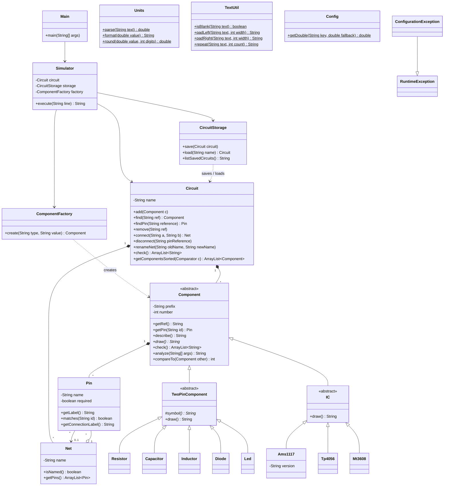

# Class diagram

```mermaid
classDiagram
    direction TB

    class Main {
        +main(String[] args)
    }
    class Simulator {
        -Circuit circuit
        -CircuitStorage storage
        -ComponentFactory factory
        +execute(String line) String
    }
    class ComponentFactory {
        +create(String type, String value) Component
    }
    class CircuitStorage {
        +save(Circuit circuit)
        +load(String name) Circuit
        +listSavedCircuits() String
    }

    class Circuit {
        -String name
        +add(Component c)
        +find(String ref) Component
        +findPin(String reference) Pin
        +remove(String ref)
        +connect(String a, String b) Net
        +disconnect(String pinReference)
        +renameNet(String oldName, String newName)
        +check() ArrayList~String~
        +getComponentsSorted(Comparator c) ArrayList~Component~
    }
    class Net {
        -String name
        +isNamed() boolean
        +getPins() ArrayList~Pin~
    }
    class Pin {
        -String name
        -boolean required
        +getLabel() String
        +matches(String id) boolean
        +getConnectionLabel() String
    }

    class Component {
        <<abstract>>
        -String prefix
        -int number
        +getRef() String
        +getPin(String id) Pin
        +describe() String
        +draw() String*
        +check() ArrayList~String~
        +analyze(String[] args) String
        +compareTo(Component other) int
    }
    class TwoPinComponent {
        <<abstract>>
        #symbol() String*
        +draw() String
    }
    class IC {
        <<abstract>>
        +draw() String
    }
    class Resistor
    class Capacitor
    class Inductor
    class Diode
    class Led
    class Ams1117 {
        -String version
    }
    class Tp4056
    class Mt3608

    class Units {
        +parse(String text)$ double
        +format(double value)$ String
        +round(double value, int digits)$ double
    }
    class TextUtil {
        +isBlank(String text)$ boolean
        +padLeft(String text, int width)$ String
        +padRight(String text, int width)$ String
        +repeat(String text, int count)$ String
    }
    class Config {
        +getDouble(String key, double fallback)$ double
    }
    class ConfigurationException

    Main --> Simulator
    Simulator --> Circuit
    Simulator --> CircuitStorage
    Simulator --> ComponentFactory
    ComponentFactory ..> Component : creates
    CircuitStorage ..> Circuit : saves / loads

    Circuit "1" *-- "*" Component
    Circuit "1" *-- "*" Net
    Component "1" *-- "*" Pin
    Net "1" o-- "*" Pin
    Pin "*" --> "0..1" Net

    Component <|-- TwoPinComponent
    Component <|-- IC
    TwoPinComponent <|-- Resistor
    TwoPinComponent <|-- Capacitor
    TwoPinComponent <|-- Inductor
    TwoPinComponent <|-- Diode
    TwoPinComponent <|-- Led
    IC <|-- Ams1117
    IC <|-- Tp4056
    IC <|-- Mt3608

    ConfigurationException --|> RuntimeException
```